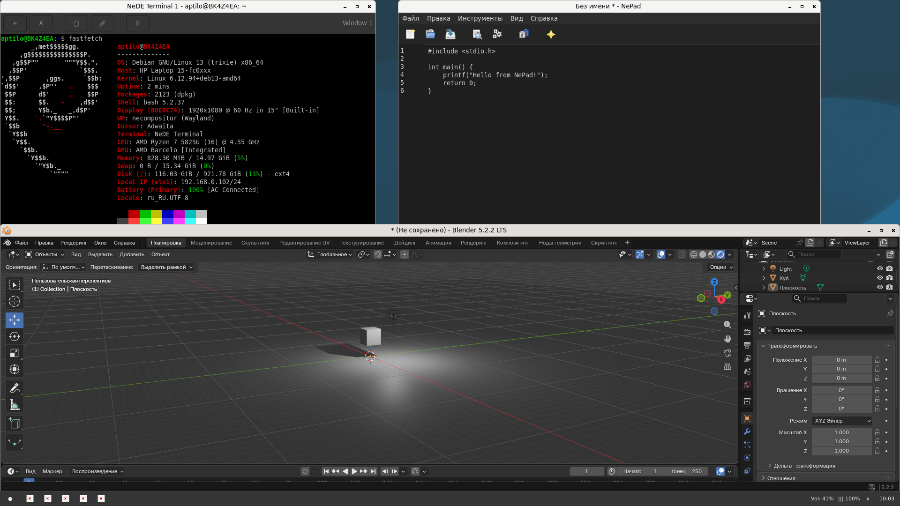

 

# NeDE - Nede Efficient Desktop Enviroment 

NeDE - Light DE for Linux/Unix systems in **Wayland**

**What is NeDE?**

NeDE is a lightweight Wayland desktop environment built on our own NeCompositor. Written in C, GTK3, and LuaLGI, NeDE is a great alternative if you want to switch from heavier DEs.

* **nedepanel** - C, GTK3 (~45 MB RAM)
* **nedesktop** - C, GTK3 (~20 MB RAM)
* **nedeuac** - C, GTK3 + Polkit + PAM (~25 MB RAM)
* **nedess** - C, GTK3
* **nedelauncher** - LuaLGI
* **NePad** - LuaLGI
* **NeCompositor** - C, labwc, wlroots (~70 MB RAM)

---

**System Requirements**

Example, NeDE in old Intel Celeron: 

* **CPU:** 1 GHz
* **RAM:** 512 MB *(note: 512 MB won't be enough for web browsing)*
* **GPU:** Any card supporting Wayland (nearly all modern GPUs)
* **Storage:** ~2 GB of free space

